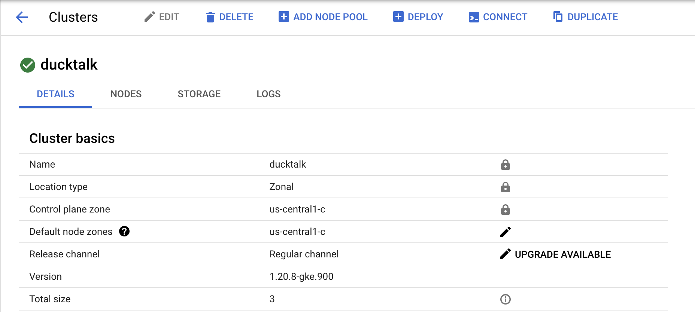
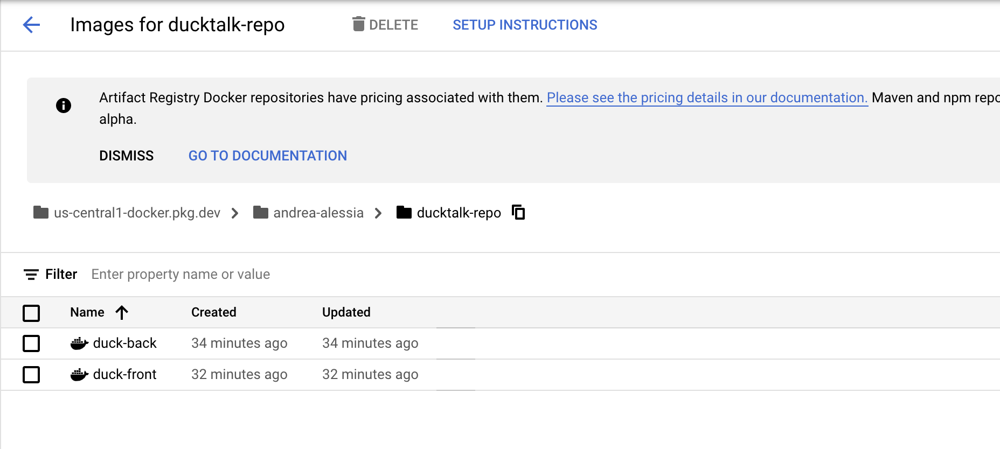
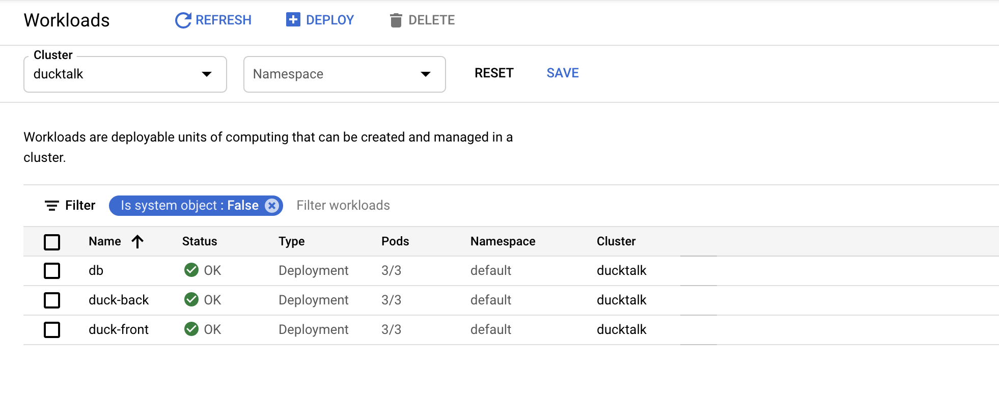

# Proyecto de Cloud Computing
## Funcionalidad
La propuesta consiste en una aplicación de mensajería online. Incluiría las secciones de:
* Registro
* Inicio de sesión
* Chat: Envío de mensajes (solo texto) y conversaciones 1 a 1

## Arquitectura

## ¿Por qué  escogió  esa  aplicación?
Es un proyecto que se está proponiendo para otro curso y nos pareció adecuado para aplicar los conceptos aprendidos de Cloud Computing. Además, al ser una aplicación de mensajería, nos gustaría desplegarlo en la nube para acceder a la aplicación desde cualquier lugar y hacerlo escalable.
## ¿Qué  características  de  la  computación  en  nube pueden ser integradas en la aplicación?
* Múltiples containers
  * Container para la base de datos
  * Container para el fontend
  * Container para el backend 
* Kubernetes: Orquestrador, monitoreo de la infraestructura y escalabilidad con load balancing
* Deployment de kubernetes en google cloud
* Almacenamiento de mensajes en PostgreSQL
* Testear tolerancia a fallos y escalabilidad (enviar múltiples mensajes en un corto tiempo)
  * Escalar luego de recibir cierta cantidad de mensajes

## Pasos necesarios para su ejecución.
1. Crear interfaz (frontend) en React para el inicio de sesión, registro y chat.
2. Diseñar y crear base de datos en PostgreSQL para almacenar los mensajes.
3. Crear el servidor en Flask: 
  3.1. Conectar con base de datos 
  3.2. Exponer REST API al frontend 
4. Migrar servidor y base de datos a containers.
5. Manejar containers con Kubernetes.
6. Crear script para enviar múltiples mensajes y testear escalabilidad y tolerancia a fallos.
7. Monitorear infraestructura mientras se ejecuta el script para ver resultados.

## Google Cloud.
Creación del cluster en google cloud

Imagenes de docker del frontend y el backend

Deplyments del frontend y el backend cada uno con 3 pods

## Referencias 
* The  NIST  Definition  of  Cloud  Computing.  Author(s)  Peter  Mell  (NIST),  Tim Grance (NIST). September 2011.
* Distributed  and  Cloud  Computing  From  Parallel  Processing  to  the  Internet  of Things. Kai Hwang, Geoffrey C. Fox,  Jack J. Dongarra.
* Cloud Computing Theory and Practice, Second Edition. Dan C. Marinescu.
* Kubernetes. Kubernetes Documentation. Disponible en https://kubernetes.io/docs/home/
